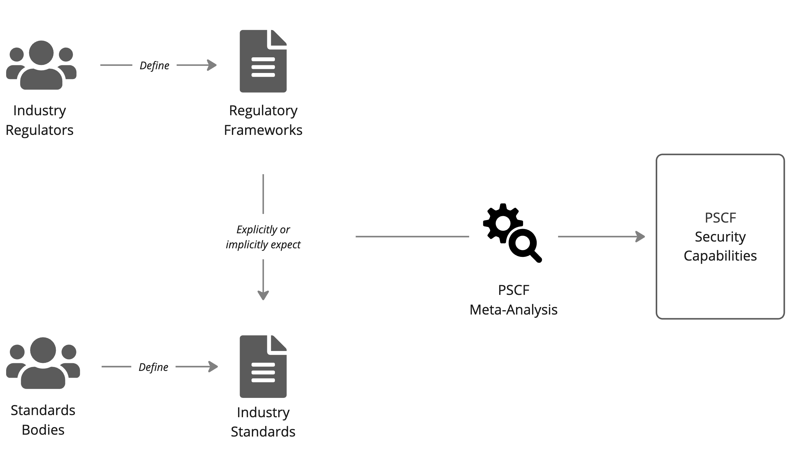

## The OWASP Product Security Capabilities Framework (PSCF) 
This is the **OWASP framework** for building security capabilities into your product delivery process and teams. 

The main website for the PSCF is on [Prods.ec](https://prods.ec/) and includes many more details about the Framework along with explanatory videos.

We created the Product Security Capability Framework to provide a clear way of thinking about software product security and the delivery activities that lead to building and maintaining the right level of security for your customers and your organisation.

This framework is designed to be the foundation of:

 - Your point-in-time appraisals of current security capability
 - The security policy defining how your organisation works to build secure products
 - Your strategic product security programme for continuous improvement

The framework currently consists of six (6) process areas and thirty-two (32) capabilities. 

 

 
 

The current 1.0 version of the framework is available [here](https://docs.google.com/spreadsheets/d/1GiQSePaFkY-wFj3RP3VUkZA81Pqzyhn9x78fSL2OTk8/edit#gid=0) in Google Sheets and anyone with an @owasp.org email address can comment and contribute there.

The Sheet allows someone to do an assessment of their own organisation's capabilities and get a report. 

The full text and multimedia site is available on [Prods.ec](https://prods.ec/)
